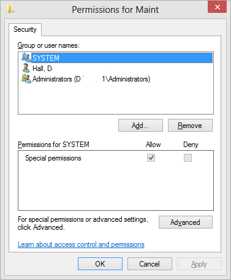

# Windows Security Editor for .NET

> Standard Windows security editor dialog for .NET derived from CommonDialog and implementing the Windows EditSecurity API.

Currently this project supports calling the dialog in English for files, directories, tasks (see [Task Scheduler Managed Wrapper project](https://github.com/dahall/taskscheduler)), and registry keys. With little effort, this project can be localized or extended to support other securable objects.

After futilely attempting to recreate all the security dialogs for another project, I decided to jump in and figure out the complicated Interop required to implement the [EditSecurity](http://msdn.microsoft.com/en-us/library/windows/desktop/aa446618(v=vs.85).aspx) Windows API call. The hard work was around the implementation of the [ISecurityInformation](http://msdn.microsoft.com/en-us/library/windows/desktop/aa378900(v=vs.85).aspx) interface and then hiding the complexity from the developer. The framework is all implemented and the project is currently in its 1.0 release.

Some special credit to the work of _oshah_ and the [article on CodeProject](http://www.codeproject.com/Articles/10811/The-Windows-Access-Control-Model-Part) and to a number of other random coders that were brave enough to publish their work on both Interop and implementing a security editor in C++.

